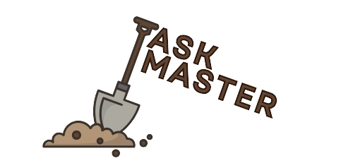
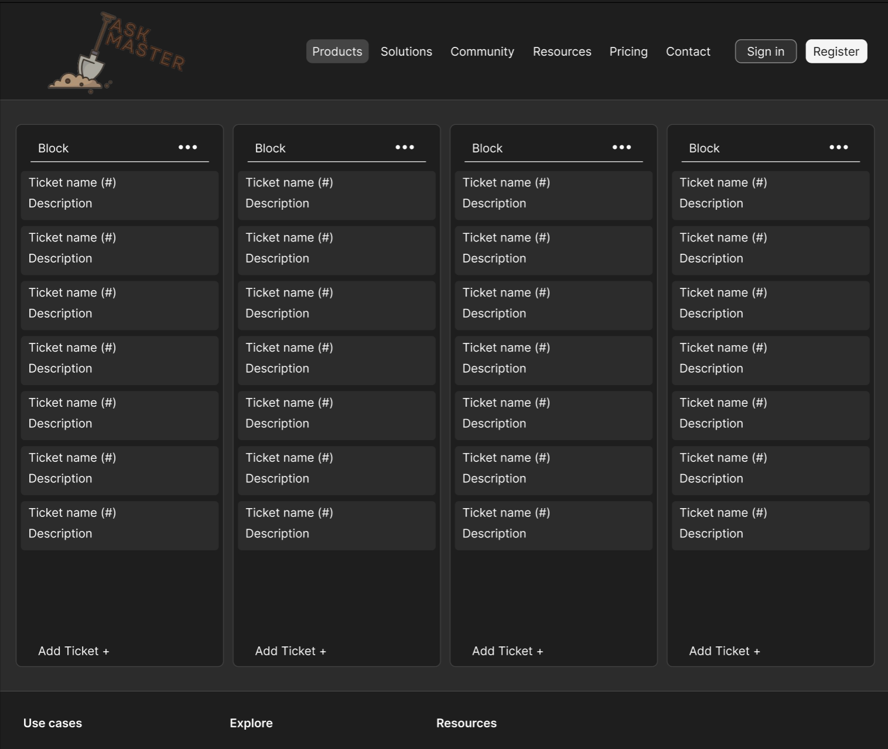
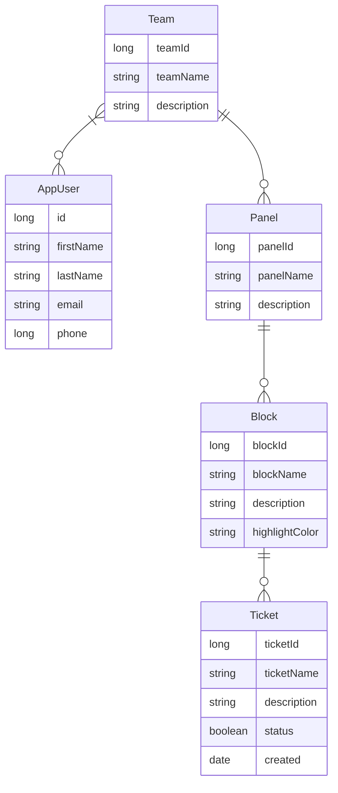

  

# Taskmaster 
Task management for individuals and teams. This project has been done as part of the course Software project 2 @Haaga-helia University of applied sciences.
Taskmaster will provide simple and fluent task and project management for groups and individuals.
## Key features
- Sign up for teamwork teams with codes / link
- CRUD for panel (project)
- CRUD for block (list)
- CRUD for ticket (item)
- Drag and drop your tasks on kanban board
- Assign tasks for users
- Commenting tasks
- Analytics on tasks for project
- Search and filtering
  
## Used technologies 
 - Spring Boot
 - Vite React
 - Postgersql
 - H2
## Team members
   - Kosti Kangasmaa https://github.com/kostikangasmaa
   - Jouni Tuomela https://github.com/jouniAUT
   - Hilja Katajamäki https://github.com/hilja04
   - Ikechukwu Aniebonam https://github.com/ikeani
## Links
 - __Backlog:__ https://github.com/orgs/teamroutine/projects/2
 - __Backend:__ https://taskmaster-git-ohjelmistoprojekti-2-taskmaster.2.rahtiapp.fi/api/panels
 - __Frontend:__ https://taskmaster-8ien.onrender.com/
## Developer guide
   #### Minimum requirments for components
   - Node.js version 22.13.0
   - Java version 17
   - Spring version 3.4.1
   - Vite version 6.0.11
   #### npm packages to install
   - npm install react-router-dom
### UI Draft

  

### Frontend UI plan
The project frontend will be constructed using following Material UI components and icons.
#### Components
   - Modals for Crud add and edit
   - Buttons
   - Textfield
   - Dividers
   - Letter avatars
   - Cards (Ticket)
   - Paper (Block)
#### icons
   - MoreHoriz and MoreVert
   - AddCircle
   - CheckCircle
## Data model
### Entity relationship diagram

## Testing
### Frontend testing
The project uses Vitest as a testing framework optimized for JavaScript and TypeScript. Tests have been written using the following tools and techniques:

#### Vitest
Vitest is a testing framework designed for Vite projects. It supports both unit and integration tests. It uses jsdom to create a virtual environment that allows DOM editing, event handling, and interactions between React components.

#### React Testing Library
The project utilizes @testing-library/react, which makes testing React components simple and fast. It allows users to test components without real events. It simulates the events, which means that the tests don't affect the actual application.

#### Test coverage
Test coverage is tracked using the V8 component, which provides detailed reports on the results and the coverage of the tests.

### Backend testing
The backend is implemented using Spring Boot, which offers various tools for Java testing.

#### JUnit 5
JUnit 5 is a framework for Java tests, especially for unit tests. Service and repository classes of the Taskmaster project are tested using JUnit 5.

#### Mockito
Mockito is a mocking library for Java applications. It is used to mock data for testing purposes, especially in controller classes. For integration tests, mocked data is used to ensure that the testing environment remains stable and independent of external resources.

   
## Work in progress
 - Firebase / Spring security authentication
 - Custom styling for projects 
 - Custom emoji upload 
 - Use modals
 - Calendar + Kalenterikutsu
 - Due dates
 - Assign and view random task 
 - Light and darkmode 
 - Mobile styling
 - Assign and view random task
 - Archive a panel, block and ticket