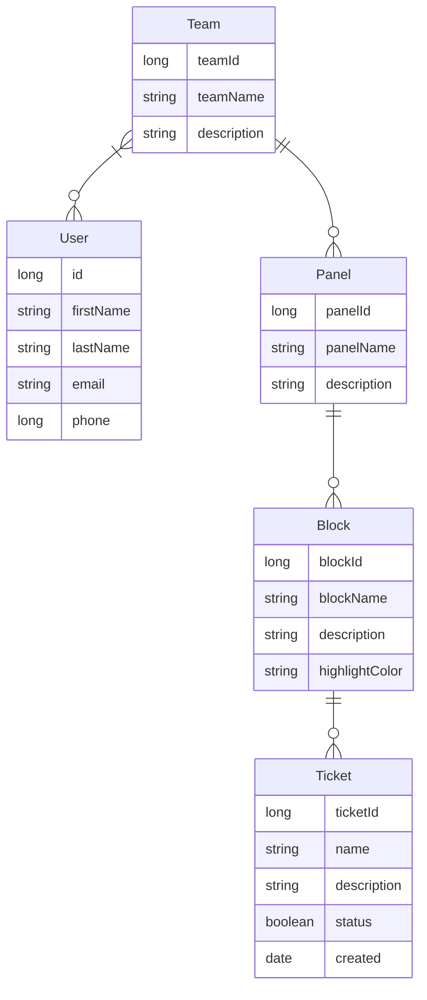

  

# Taskmaster
Task management for individuals and teams. This project has been done as part of the course Software project 2 @Haaga-helia University of applied sciences.
Taskmaster will provide simple and fluent task and project management for groups and individuals.
## Key features
- Sign up for teamwork teams with codes / link
- CRUD for panel (project)
- CRUD for block (list)
- CRUD for ticket (item)
- Drag and drop your tasks on kanban board
- Assign tasks for users
- Commenting tasks
- Analytics on tasks for project
- Search and filtering
  
## Used technologies 
 - Spring Boot
 - Vite React
 - Postgersql
 - H2
## Team members
   - Kosti Kangasmaa https://github.com/kostikangasmaa
   - Jouni Tuomela https://github.com/jouniAUT
   - Hilja Katajamäki https://github.com/hilja04
   - Ikechukwu Aniebonam https://github.com/ikeani
## Links
 - __Backlog:__ https://github.com/orgs/teamroutine/projects/2
## Developer guide
## Data model
### Entity relationship diagram

   
## Work in progress
 - Firebase / Spring security authentication
 - Custom styling for projects 
 - Custom emoji upload 
 - Use modals
 - Calendar + Kalenterikutsu
 - Due dates
 - Assign and view random task 
 - Light and darkmode 
 - Mobile styling
 - Assign and view random task
 - Archive a panel, block and ticket
