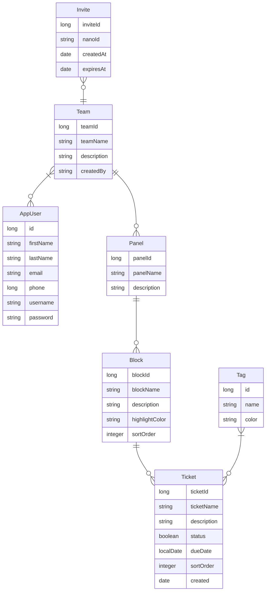

<div align="center">
  
</div>

# Taskmaster [](https://github.com/teamroutine/taskmaster/actions/workflows/ci.yml)
Task management for individuals and teams. This project has been done as part of the course Software project 2 @Haaga-helia University of applied sciences.
Taskmaster will provide simple and fluent task and project management for groups and individuals.
## Key features
- Sign up for teamwork teams with codes / link
- CRUD for panel (project)
- CRUD for block (list)
- CRUD for ticket (item)
- Drag and drop your tasks on kanban board
- Assign tasks for users
- Commenting tasks
- Analytics on tasks for project
- Search and filtering
  
## Used technologies 
 - Spring Boot
 - Vite React
 - PostgreSQL
 - H2
## Team members
   - Kosti Kangasmaa https://github.com/kostikangasmaa
   - Jouni Tuomela https://github.com/jouniAUT
   - Hilja Katajamäki https://github.com/hilja04
   - Ikechukwu Aniebonam https://github.com/ikeani
## Links
 - __Backlog:__ https://github.com/orgs/teamroutine/projects/2
 - __Backend:__ https://taskmaster-git-ohjelmistoprojekti-2-taskmaster.2.rahtiapp.fi/api/panels
 - __Frontend:__ https://taskmaster-8ien.onrender.com/
## Developer guide
   #### Minimum requirements for components
   - Node.js version 22.13.0
   - Java version 17
   - Spring Boot version 3.4.1
   - Vite version 6.0.11
   #### Backend
   - **Spring Boot**
      - Java framework used for developing the REST-interfaces and business logic
   - **Spring Security and JWT**
      - For user authentication and managing protected routes
   - **Spring Boot Validation Starter**
      - For validating the input data
   - **Swagger / OpenAPI**
      - Interactive API documentation is available via Swagger UI at /swagger-ui.html, allowing you to explore and test endpoints directly.
```bash
http://localhost:8080/swagger-ui/index.html
```
   #### Frontend
   - **React** 
      - For creating the user interface
   - **React Router DOM**
      - For routing
   - **MUI (Material UI)**
      - For user interface components, icons and appearance of the application
   - **jwt-decode**
      - For decoding of the JWT-tokens
   - **Atlaskit Pragmatic Drag & Drop**
      - Library for Drag & Drop functionality of blocks and tickets
      You can install all frontend components by running the command:
```bash
npm install
```
   #### Database
   - **PostgreSQL**
      - Database for production environment
   - **H2**
      - Internal database for testing and development
   #### Developer tools
   - **Vite**
      - Frontend server for development and bundling
   - **ESLint**
      - Quality assurance of the frontend code
   - **jnanoid-enhanced**
      - For creating unique invite codes into teams


### UI Draft
<div align="center">
  
</div>

### Frontend UI plan
The project frontend will be constructed using following Material UI components and icons.
#### Components
   - Modals for Crud add and edit
   - Buttons
   - Textfield
   - Dividers
   - Letter avatars
   - Cards (Ticket)
   - Paper (Block)
#### Icons
   - MoreHoriz and MoreVert
   - AddCircle
   - CheckCircle
## Data model
### Entity relationship diagram


## Testing
### Frontend testing
The project uses Vitest as a testing framework optimized for JavaScript and TypeScript. Tests have been written using the following tools and techniques:

#### Vitest
Vitest is a testing framework designed for Vite projects. It supports both unit and integration tests. It uses jsdom to create a virtual environment that allows DOM editing, event handling, and interactions between React components.

#### React Testing Library
The project utilizes @testing-library/react, which makes testing React components simple and fast. It allows users to test components without real events. It simulates the events, which means that the tests don't affect the actual application.

#### Test coverage
Test coverage is tracked using the V8 component, which provides detailed reports on the results and the coverage of the tests.

### Backend testing
The backend is implemented using Spring Boot, which offers various tools for Java testing.

#### JUnit 5
JUnit 5 is a framework for Java tests, especially for unit tests. Service and repository classes of the Taskmaster project are tested using JUnit 5.

#### Mockito
Mockito is a mocking library for Java applications. It is used to mock data for testing purposes, especially in controller classes. For integration tests, mocked data is used to ensure that the testing environment remains stable and independent of external resources.


## Getting started

### 1. Clone the repository
```bash
   git clone https://github.com/teamroutine/taskmaster.git
```
### 2. Install dependencies and start the frontend
Navigate to the frontend directory and start the development server:
**On Windows**
```bash
cd C:\ohjelmistoprojekti2\taskmasterfront
```
```bash
npm install
```
```bash
npm run dev
```
**On macOS/Linux**
```bash
cd taskmasterfront
```
```bash
npm install
```
```bash
npm run dev
```
### 3. Run Backend (Minimum Requirement Java 17)
```bash
./mvnw spring-boot:run
```
### 4. Visit frontend and backend API
```bash
http://localhost:5173
```
```bash
http://localhost:8080
```
### 5. Environment configuration
If .env file is missing: Create taskmasterfront/.env file and add the following:
```bash
VITE_API_URL=http://localhost:8080/api
```
If application.properties file is missing: Create taskmaster/src/main/resources/application.properties file and add the following:
```bash
spring.application.name=taskmaster
spring.datasource.url=jdbc:h2:mem:testdb
spring.datasource.driverClassName=org.h2.Driver
spring.h2.console.enabled=true
spring.datasource.username=sa
spring.datasource.password=password
auth.jwt-secret=syour-256-bit-long-secret-key-here
spring.profiles.active=rahti
```
### 6. Backend API documentation available at:
```bash
http://localhost:8080/swagger-ui/index.html
```
## Work in progress
 - Firebase / Spring security authentication
 - Custom styling for projects 
 - Custom emoji upload 
 - Use modals
 - Calendar + Calendar invites
 - Due dates
 - Assign and view random task 
 - Light and darkmode 
 - Mobile styling
 - Archive a panel, block and ticket
